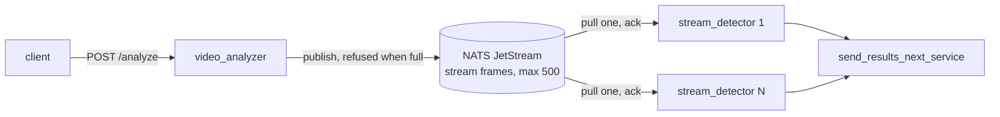

# Video processing pipeline

Two Python services joined by a bounded work queue. The analyzer turns a video file into JPEG frames at 2 or 4 fps and publishes them; N detector workers pull frames, run face detection, and hand results to the next stage.



## Run

```bash
docker compose up --build
curl -X POST localhost:8000/analyze -H 'content-type: application/json' \
     -d '{"file_path": "G20_Summit.mp4", "fps": 2}'
```

The sample video is not in the repository (it is over GitHub's file limit); place it in `videos/`, which is mounted read-only into the analyzer. Scale detectors with `--scale stream_detector=4`.

The detector is the provided mock by default. `DETECTOR=haar docker compose up --build` swaps in OpenCV's Haar frontal-face cascade, which ships inside the OpenCV wheel, so the demo shows real boxes and real per-frame latency without a model download. It is a stand-in, not a recommendation: on this sample frame it finds the three frontal faces and misses the two in profile.


Tests need no broker:

```bash
uv venv && uv pip install -r requirements-dev.txt
.venv/bin/ruff check . && .venv/bin/pytest
```

## API

`POST /analyze` takes `{"file_path": "<relative to videos/>", "fps": 2 | 4}` and returns 200 with `{"video_id", "frames_dispatched"}` only after the last frame has been accepted by the queue, as the brief requires. Other outcomes: 422 for a malformed body or any fps other than 2 or 4 (strict, so `"2"` and `2.0` are rejected too), 404 for a missing file, 400 for a path outside `videos/` or a file OpenCV cannot open, 503 when the queue is unreachable or stays full for 60 seconds. A 503 names the `video_id` and how many frames were already dispatched, so a caller can reconcile partial results. Every request gets its own `video_id` (file stem plus a uuid), so retries and concurrent runs of the same file stay distinguishable downstream.

## Design decisions

The queue is NATS JetStream, configured as a work queue: messages are deleted on ack, the stream is capped at `MAX_BACKLOG` messages (default 500, about 40 MB of 720p JPEG), and a publish into a full stream is refused by the server. Three properties drove the choice.

Pull, not push. A detector takes the next frame when it is free. A load balancer in front of N detectors would round-robin blindly and let frames queue behind a slow worker while another sits idle; for a heavy inference step, utilization must follow real capacity.

Backpressure without polling. When detectors fall behind, the server says no and the analyzer waits, so a slow fleet throttles ingestion instead of growing memory. The alternative policy, dropping the oldest frames, is one configuration flag away (`discard: old`) and is the right call if "always fast 200" matters more than "every frame was dispatched". I kept the brief's contract.

Per-message redelivery. A frame whose worker dies mid-inference is redelivered after `ack_wait` (60 s, which must exceed one detection). A frame that cannot be decoded, makes the detector raise, or cannot be forwarded is logged, counted, and terminated, never retried: for sampled video a lost frame is a momentary dip in effective fps, and a poison frame must not take the fleet down.

I built this first on Redis Streams and replaced it. Redis has no bounded publish that refuses, so backpressure was a client-side length poll with a soft bound; a consumer group stamps idle time per batch rather than per message, so safe reclaim needed batch-size arithmetic; and the group's lag reports NULL under out-of-order acks. Each was solvable, and each solution was code a reviewer would have to read. NATS gives the same semantics from a 20 MB binary. RabbitMQ gives them too, at several times the footprint; Kafka is a log and the wrong shape for a work queue.

Rejected along the way:

| Option | Why not |
|---|---|
| Redis Streams (built first) | no publish that refuses when full, idle clock per batch not per message, lag reports NULL under out-of-order acks; each fix was code to read |
| RabbitMQ | same queue semantics as NATS at several times the footprint |
| Kafka | a partitioned log; one consumer per partition stalls on a slow worker, no per-message ack |
| Direct HTTP or ZeroMQ push to detectors | round-robin ignores which worker is free; no redelivery when one dies |
| Drop oldest frames when full | breaks the brief's "200 means every frame dispatched"; kept as a one-flag alternative |
| Sample by presentation timestamp | correct for variable frame rate, but its edge cases (PTS resets, missing timestamps) outnumbered the requirements |
| Batch reads and acks | cheaper per frame, but a batch's idle clock made safe redelivery depend on batch size times inference time |
| Health endpoint and compose healthcheck | nothing consumed it and it went red under normal load |
| Exactly-once delivery | not worth it: a duplicate frame costs one repeated detection |

Frames are sampled by index against the container's nominal frame rate (25 fps at 2 fps means every 12.5th frame, so alternating 12 and 13). Variable-frame-rate sources will drift; sampling by presentation timestamp is the fix, and I removed an earlier version of it because the edge cases it handled outnumbered the requirements. JPEG quality is 75: 80 KB per 720p frame against 130 KB at 90, with no visible effect on detection.

## Operations

Prometheus metrics: the analyzer at `:8000/metrics` (frames dispatched), each detector at `:9100/metrics` inside the compose network (frames processed and dropped, detection latency histogram). Queue depth and in-flight count come from NATS at `:8222/jsz?consumers=true`; that number is what an autoscaler should act on.

Measured on the sample videos (720p and 540p, 2 fps): extraction costs the analyzer about 1.5% of one core per second of video; the Haar detector costs 40 to 60 ms per frame, so one real-time video needs about 10% of a detector core, and a 12-core host saturates near 100 concurrent real-time videos before the queue starts refusing. The mock detector is dominated by JPEG decode at about 1 ms per frame.

What fails and what happens:

| Failure | Behaviour | Signal |
|---|---|---|
| Bad request, missing or unreadable file | 4xx, nothing published | response |
| Queue full for 60 s | 503 naming `video_id` and frames already dispatched; those stay queued | response, `frames_dispatched_total` stalls |
| NATS unreachable mid-request | 503 as above | response, analyzer log |
| NATS down when the analyzer starts | analyzer exits, compose restarts it until NATS is healthy | `docker compose ps` |
| NATS container recreated (stream lost) | detectors reconnect and retry on their own; the analyzer returns 503 until restarted, since it creates the stream at startup | analyzer log |
| Detector dies mid-frame | frame redelivered to another worker after 60 s | `num_ack_pending` at `:8222/jsz` |
| Frame undecodable, detector raises, forwarding raises | frame terminated, never retried | `frames_dropped_total`, detector log with `video_id` and `frame_id` |
| Detectors slower than ingestion | queue fills to 500, analyzer waits, then 503 | `num_pending`, request latency |
| `MAX_BACKLOG` changed between deploys | stream updated in place at analyzer start | none needed |

Limits, on purpose: results are at-least-once (a killed worker causes one redelivery); the consumer's `ack_wait` is fixed when the durable consumer is first created, so changing it means deleting the consumer; the analyzer holds one request open for the whole extraction, which is what the brief's 200-after-dispatch contract requires.
