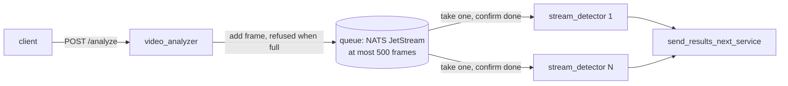

# Video processing pipeline

Two small services and a queue between them. The analyzer takes a video file, picks frames at 2 or 4 per second, turns each into a JPEG and puts it on the queue. Any number of detector workers take frames off the queue, look for faces, and pass the result to the next stage.



## Run

```bash
docker compose up --build
curl -X POST localhost:8000/analyze -H 'content-type: application/json' \
     -d '{"file_path": "G20_Summit.mp4", "fps": 2}'
```

The sample video is not in the repository because it is over GitHub's size limit. Put it in `videos/`, which the analyzer reads. Run more detectors with `--scale stream_detector=4`.

The detector is the mock from the assignment by default. `DETECTOR=haar docker compose up --build` swaps in OpenCV's built-in face detector, which comes inside the OpenCV package, so the demo shows real boxes and real per-frame timing without downloading a model. It is a stand-in, not a recommendation: on the frame below it finds the three faces looking at the camera and misses the two in profile.


Tests run without the queue:

```bash
uv venv && uv pip install -r requirements-dev.txt
.venv/bin/ruff check . && .venv/bin/pytest
```

## API

`POST /analyze` takes `{"file_path": "<relative to videos/>", "fps": 2 | 4}`. It answers 200 with `{"video_id", "frames_dispatched"}` only once the last frame has been accepted by the queue, as the brief asks. Other answers: 422 when the body is malformed or fps is anything but 2 or 4 (the text `"2"` and the number `2.0` are rejected too), 404 when the file is missing, 400 when the path points outside `videos/` or OpenCV cannot open the file, 503 when the queue is unreachable or has been full for a minute. A 503 says which `video_id` it was and how many frames had already gone through, so the caller can make sense of partial results. Every request gets a fresh `video_id` (the file name plus a random suffix), so two runs of the same file never get mixed up downstream.

## How it works and why

The queue is NATS JetStream, set up so that a frame is removed once a worker confirms it is done, the queue holds at most `MAX_BACKLOG` frames (500 by default, about 40 MB of JPEG), and adding a frame to a full queue is refused. Three things made this the right shape.

Workers take work, nobody hands it to them. A detector asks for the next frame when it is free. Sending frames to detectors in turn would let frames pile up behind a slow worker while another sits idle. When each frame costs real compute, the busy workers must not set the pace.

Slowing down is automatic. When detectors fall behind, the queue fills, the queue refuses new frames, and the analyzer waits. Ingestion slows to whatever the detectors can do instead of memory growing. The other reasonable policy, throwing away the oldest frames, is a one-line change and the right one if "answer fast, always" matters more than "every frame got through". I kept what the brief asked for.

Lost work comes back, bad work is dropped. If a worker dies while holding a frame, the queue hands that frame to another worker after 60 seconds (this must be longer than one detection). A frame that cannot be decoded, makes the detector fail, or cannot be forwarded is logged, counted and thrown away, never retried: for sampled video a missing frame is a brief dip in frame rate, and one bad frame must never take down the fleet.

I built this first on Redis and replaced it. Redis has no way to refuse a frame when the queue is full, so the analyzer had to keep asking how long the queue was; it times out held frames per batch, not per frame, so safe retry depended on batch size; and its queue-depth number is undefined in a common case. Each problem had a fix, and each fix was more code for a reader to check. NATS does the same job from a 20 MB binary. RabbitMQ would too, at several times the size; Kafka is a log, the wrong tool for handing out jobs.

Options rejected along the way:

| Option | Why not |
|---|---|
| Redis (built first) | cannot refuse when full; times out held frames per batch; queue depth undefined in a common case |
| RabbitMQ | does the same as NATS at several times the footprint |
| Kafka | built for replaying a log; a slow worker stalls its whole partition, and it cannot confirm frames one by one |
| Sending frames straight to detectors over HTTP or ZeroMQ | frames pile up behind slow workers; nothing brings back a frame when a worker dies |
| Throw away the oldest frames when full | breaks the brief's "200 means every frame went through"; kept as a one-line alternative |
| Pick frames by their timestamps | correct for videos with a varying frame rate, but the corner cases it handled outnumbered the requirements |
| Take and confirm frames in batches | fewer round trips, but the timeout for a held frame then depends on batch size times detection time |
| A health endpoint plus a compose health check | nothing used it, and it turned red under ordinary load |
| Guaranteeing each frame is processed exactly once | not worth it: a duplicate costs one repeated detection |

Frames are chosen by position, using the frame rate the file declares (25 per second at 2 per second means every 12.5th frame, so alternating 12 and 13). Files whose frame rate varies will drift; choosing by timestamp fixes that, and I removed an earlier version because it handled more corner cases than the task has. JPEG quality is 75: 80 KB per 720p frame instead of 130 KB at 90, with no visible effect on detection.

## Running it

Prometheus metrics: the analyzer at `:8000/metrics` (frames sent), each detector at `:9100/metrics` inside the compose network (frames processed and dropped, detection time). How many frames are waiting or being worked on comes from NATS at `:8222/jsz?consumers=true`; that is the number to scale detectors on.

Measured on the sample videos (720p and 540p, 2 frames per second): reading and encoding frames costs the analyzer about 1.5% of one core per second of video; the OpenCV face detector takes 40 to 60 ms per frame, so one video analyzed at its natural speed needs about a tenth of a detector core, and a 12-core machine is full at roughly 100 such videos at once before the queue starts refusing. With the mock detector the cost is decoding the JPEG, about 1 ms per frame.

What fails and what happens:

| Failure | Behaviour | Where you see it |
|---|---|---|
| Bad request, missing or unreadable file | 4xx, nothing sent | response |
| Queue full for a minute | 503 naming the `video_id` and how many frames went through; those stay queued | response, `frames_dispatched_total` stops moving |
| Queue unreachable mid-request | 503 as above | response, analyzer log |
| Queue down when the analyzer starts | analyzer exits; compose restarts it until the queue is healthy | `docker compose ps` |
| Queue container recreated (contents lost) | detectors reconnect and wait on their own; the analyzer answers 503 until restarted, because it sets up the queue at start | analyzer log |
| Detector dies holding a frame | another worker gets the frame after 60 s | `num_ack_pending` at `:8222/jsz` |
| Frame undecodable, detector fails, forwarding fails | frame dropped, never retried | `frames_dropped_total`, detector log with `video_id` and `frame_id` |
| Detectors slower than the video coming in | queue fills to 500, analyzer waits, then 503 | `num_pending`, request time |
| `MAX_BACKLOG` changed between deploys | queue limit updated in place when the analyzer starts | nothing needed |

Known limits, chosen on purpose: a frame can be processed twice if its worker died (once per death); the 60-second hold time is set when the detectors' shared subscription is first created, so changing it means deleting that subscription; the analyzer keeps one request open for the whole video, which is what the brief's "200 after everything is sent" requires.
